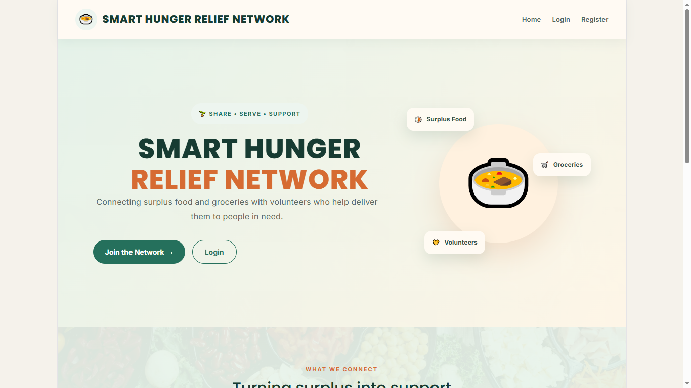
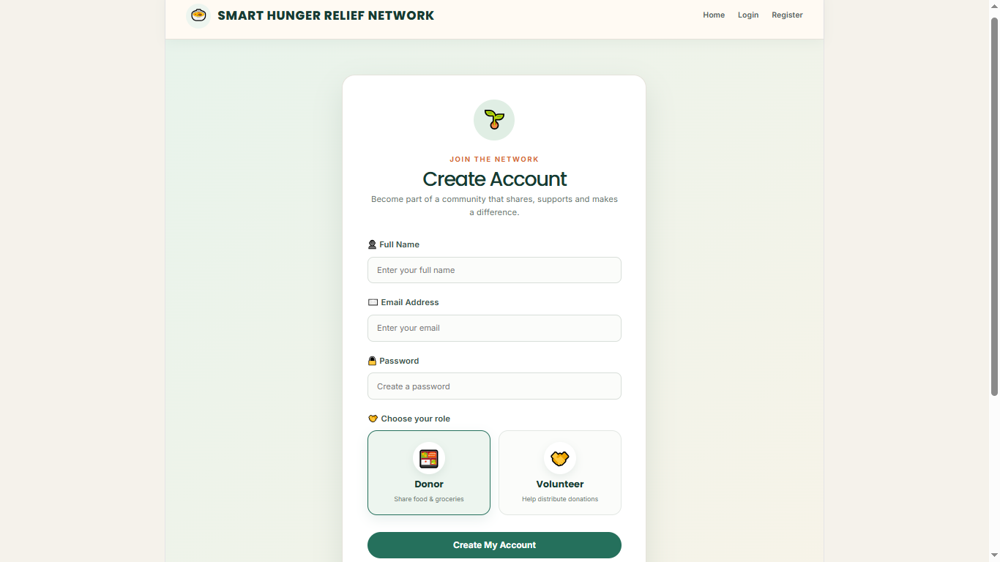
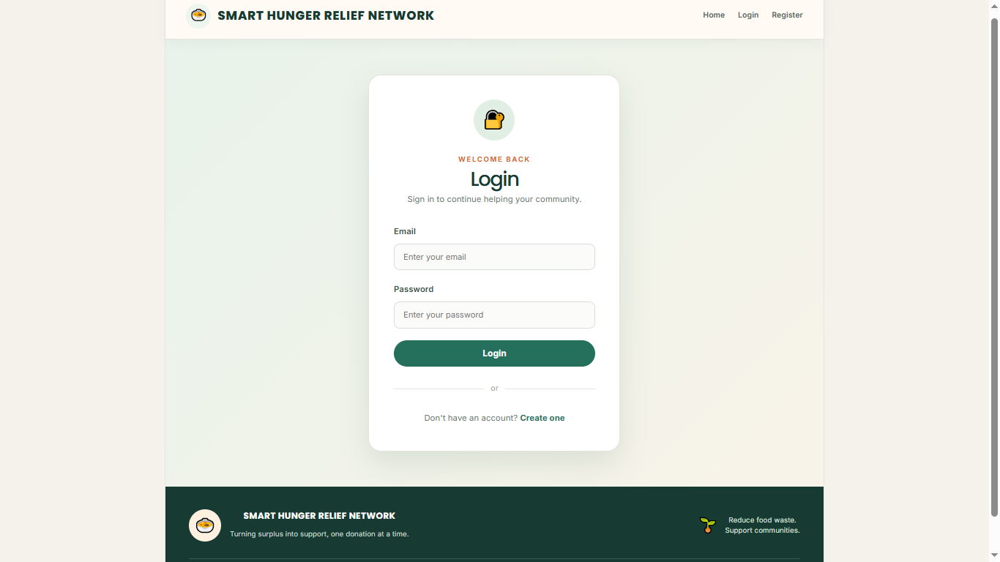
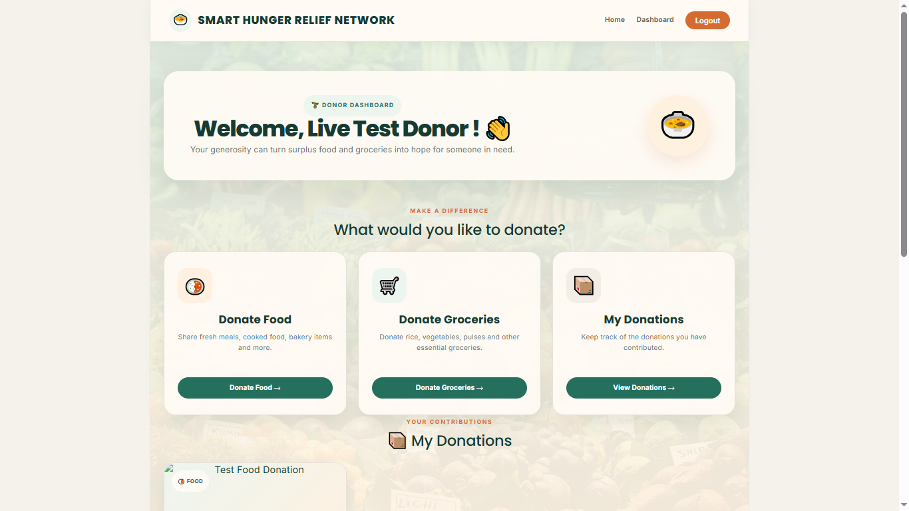
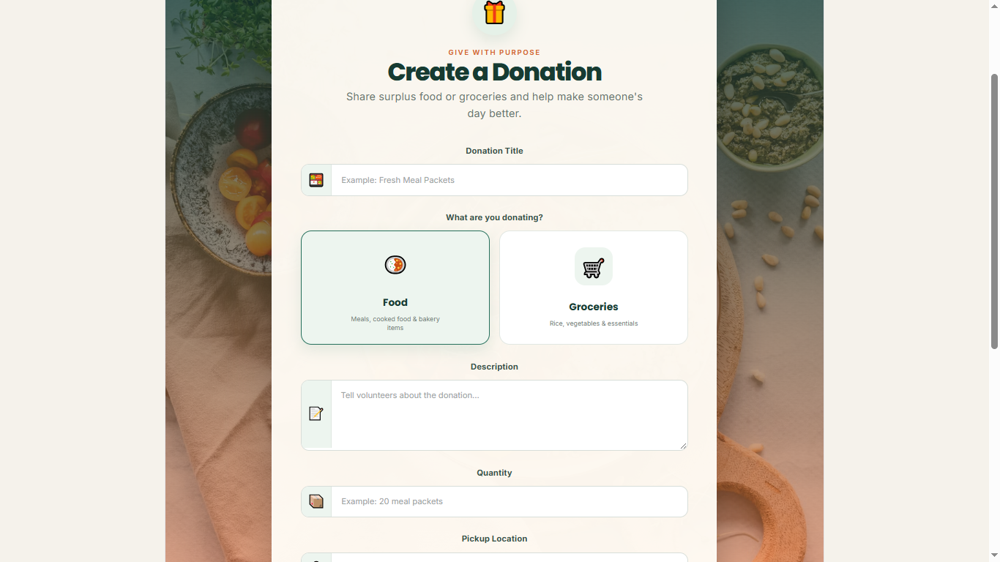
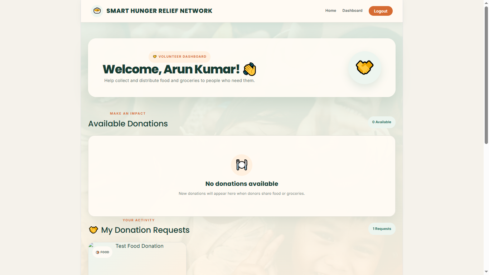
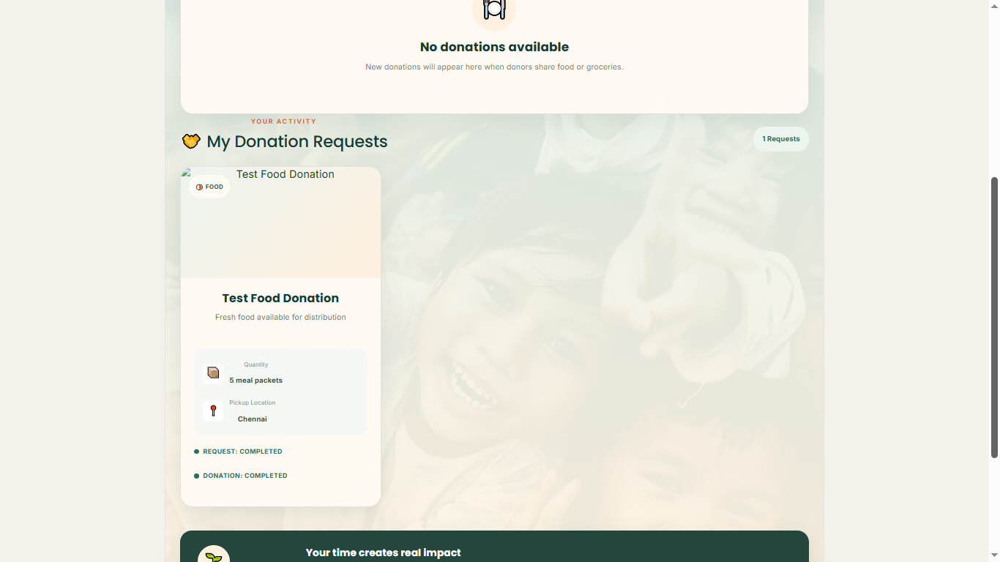
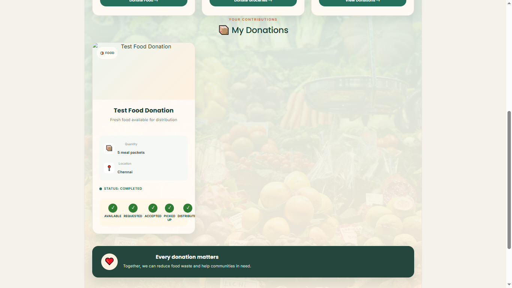

# 🍲 SMART HUNGER RELIEF NETWORK

> A full-stack web platform that connects surplus food and grocery donors with volunteers for collection and distribution.

[](https://react.dev/)
[](https://spring.io/projects/spring-boot)
[](https://www.mysql.com/)
[](https://jwt.io/)

---

## 🌱 About the Project

**Smart Hunger Relief Network** is a full-stack web application designed to connect people who want to donate surplus food or groceries with volunteers who can collect and distribute those donations to people in need.

The platform provides a structured digital workflow for creating donations, finding available donations, requesting donations, accepting volunteer requests, and tracking the complete distribution process.

The system supports both:

* 🍱 **Food donations**
* 🛒 **Grocery donations**

---

## 🎯 Problem Statement

Food and essential groceries are often wasted while many people struggle to access basic necessities.

Traditional donation processes can make it difficult to:

* Find available donations
* Connect donors with volunteers
* Track donation requests
* Monitor the distribution process
* Maintain a structured record of donations

The **Smart Hunger Relief Network** provides a centralized platform to organize this process digitally.

---

## 💡 Objectives

The main objectives of this project are:

* Reduce food and grocery wastage
* Connect donors with volunteers
* Make donation posting simple
* Allow volunteers to discover available donations
* Provide a request and acceptance workflow
* Track donation progress
* Support image uploads for donations
* Provide secure authentication
* Store donation and user information in MySQL
* Provide a scalable full-stack architecture

---

# 👥 User Roles

## 🧑‍🍳 Donor

Donors can:

* Register an account
* Login securely
* Post food donations
* Post grocery donations
* Upload donation images
* Specify quantity and location
* View their donations
* View volunteer requests
* Accept volunteer requests
* Track donation status

---

## 🧑‍🤝‍🧑 Volunteer

Volunteers can:

* Register an account
* Login securely
* View available donations
* Search donations
* View donation details
* Request donations
* Track requested donations
* Mark donations as picked up
* Mark donations as distributed
* Mark donations as completed

---

## 👨‍💼 Admin

The backend also provides administrative functionality for:

* Viewing users
* Viewing donors
* Viewing volunteers
* Viewing donations
* Monitoring donation statistics
* Managing donation statuses

---

# ✨ Key Features

### 🔐 Authentication

* User registration
* User login
* JWT-based authentication
* BCrypt password hashing
* Role-based access control
* Donor and Volunteer roles

### 🍱 Donation Management

* Create food donations
* Create grocery donations
* Add descriptions
* Specify quantity
* Add location
* Upload donation images
* View donation information

### 🔎 Search & Filtering

Users can search donations using information such as:

* Donation title
* Description
* Location
* Category

### 🤝 Volunteer Requests

Volunteers can request available donations.

Donors can review and accept volunteer requests.

### 📊 Status Tracking

Every donation follows a structured lifecycle:

```text
AVAILABLE
    ↓
REQUESTED
    ↓
ACCEPTED
    ↓
PICKED_UP
    ↓
DISTRIBUTED
    ↓
COMPLETED
```

This allows both donors and volunteers to understand the current stage of every donation.

---

# 🏗️ System Architecture

```text
                    ┌─────────────────────┐
                    │       User          │
                    │ Donor / Volunteer   │
                    └──────────┬──────────┘
                               │
                               ▼
                    ┌─────────────────────┐
                    │      Netlify        │
                    │ React + TypeScript  │
                    │       + Vite        │
                    └──────────┬──────────┘
                               │
                         REST API / HTTP
                               │
                               ▼
                    ┌─────────────────────┐
                    │       Render        │
                    │ Java 21 + Spring    │
                    │       Boot          │
                    │ JWT + Spring Security│
                    └──────────┬──────────┘
                               │
                         JPA / Hibernate
                               │
                               ▼
                    ┌─────────────────────┐
                    │       Aiven         │
                    │       MySQL         │
                    └─────────────────────┘
```

---

# 🛠️ Technology Stack

## Frontend

* React.js
* TypeScript
* Vite
* React Router
* HTML5
* CSS3

## Backend

* Java 21
* Spring Boot
* Spring Web
* Spring Data JPA
* Hibernate
* Spring Security
* Maven

## Database

* MySQL
* Aiven MySQL

## Authentication & Security

* JWT
* BCrypt
* Role-based authorization
* CORS

## File Upload

* Spring Boot `MultipartFile`
* Local upload handling

## Development Tools

* Visual Studio Code
* MySQL Workbench
* Git
* GitHub
* Node.js
* npm

## Deployment

* Netlify — Frontend
* Render — Backend
* Aiven — MySQL Database

---

# 📁 Project Structure

```text
SMART HUNGER RELIEF NETWORK
│
├── frontend
│   ├── public
│   ├── src
│   │   ├── components
│   │   ├── pages
│   │   ├── App.tsx
│   │   ├── api.ts
│   │   ├── App.css
│   │   └── main.tsx
│   │
│   ├── package.json
│   ├── vite.config.ts
│   └── .gitignore
│
├── backend
│   ├── src
│   │   └── main
│   │       ├── java
│   │       │   └── Smart
│   │       │       └── Hunger
│   │       │           └── Relief
│   │       │               └── Network
│   │       │
│   │       └── resources
│   │
│   ├── pom.xml
│   ├── Dockerfile
│   └── .gitignore
│
├── netlify.toml
├── .gitignore
└── README.md
```

---

# 🧩 Backend Architecture

The backend follows a layered architecture:

```text
Controller
     ↓
Service
     ↓
Repository
     ↓
Database
```

### Controller Layer

Handles HTTP requests and API endpoints.

### Service Layer

Contains application/business logic.

### Repository Layer

Handles database operations through Spring Data JPA.

### Model Layer

Contains entities representing application data.

### Security Layer

Handles:

* JWT generation
* JWT validation
* Authentication
* Authorization
* Password encryption

---

# 🗄️ Database

The application uses **MySQL** for persistent data storage.

Main entities include:

### Users

Stores:

* User ID
* Name
* Email
* Encrypted password
* Role

### Donations

Stores:

* Donation ID
* Title
* Category
* Description
* Quantity
* Location
* Status
* Image URL
* Creation time
* Donor

### Donation Requests

Stores:

* Request ID
* Donation
* Volunteer
* Request status
* Request time

---

# 🔌 API Overview

## Authentication

```text
POST /api/auth/register
POST /api/auth/login
```

## Donations

```text
GET  /api/donations
GET  /api/donations/{id}
GET  /api/donations/status/{status}
GET  /api/donations/category/{category}
GET  /api/donations/donor/{donorId}
GET  /api/donations/search
POST /api/donations
POST /api/donations/upload-image
```

## Donation Requests

```text
POST /api/requests
GET  /api/requests
GET  /api/requests/volunteer/{volunteerId}
GET  /api/requests/donation/{donationId}
PUT  /api/requests/{requestId}/accept
PUT  /api/requests/{requestId}/status
```

## Volunteers

```text
GET /api/volunteers
```

## Admin

```text
GET /api/admin/dashboard
GET /api/admin/users
GET /api/admin/users/donors
GET /api/admin/users/volunteers
GET /api/admin/donations
PUT /api/admin/donations/{id}/status
```

---

# 🔐 Security

The application implements several security mechanisms.

### Password Security

User passwords are encrypted using **BCrypt** before being stored in the database.

### JWT Authentication

After successful login, the backend generates a JWT token.

The frontend stores the token and sends it with protected API requests:

```text
Authorization: Bearer <JWT>
```

### Role-Based Authorization

Different operations are restricted according to user roles.

For example:

```text
DONOR
   ↓
Create donations
Accept volunteer requests

VOLUNTEER
   ↓
Request donations
Update donation progress

ADMIN
   ↓
Manage users
Manage donations
View statistics
```

---

# 🌐 Live Application

### Frontend

https://elaborate-meringue-c4e54d.netlify.app/

### Backend

https://smart-hunger-relief-backend.onrender.com/

### Source Code

https://github.com/santhosh0410-lab/smart-hunger-relief-network

---

# 💻 Running the Project Locally

## Prerequisites

Install:

* Java 21
* Node.js
* npm
* MySQL
* Git

---

## 1. Clone the Repository

```bash
git clone https://github.com/santhosh0410-lab/smart-hunger-relief-network.git
cd smart-hunger-relief-network
```

---

# 2. Create the Database

Open MySQL and run:

```sql
CREATE DATABASE smart_hunger_relief_network;
```

The Spring Boot application uses JPA/Hibernate to create and update the required tables.

---

# 3. Configure Backend

Configure the required environment variables:

```text
DB_URL
DB_USERNAME
DB_PASSWORD
JWT_SECRET
FRONTEND_URL
```

Do not commit real credentials or secrets to GitHub.

---

# 4. Start the Backend

Open CMD:

```cmd
cd backend
mvnw.cmd spring-boot:run
```

The backend runs locally on:

```text
http://localhost:8080
```

---

# 5. Start the Frontend

Open another terminal:

```cmd
cd frontend
npm install
npm run dev
```

The frontend runs locally on:

```text
http://localhost:5173
```

---

# 🧪 Tested Workflow

The complete donation workflow has been tested successfully:

```text
Donor Registration
        ↓
Donor Login
        ↓
Create Donation
        ↓
Volunteer Login
        ↓
View Available Donation
        ↓
Request Donation
        ↓
Donor Accepts Request
        ↓
Volunteer Picks Up
        ↓
Donation Distributed
        ↓
Donation Completed
```

The live deployment was also tested for:

* Registration
* Login
* Donor dashboard
* Volunteer dashboard
* Donation creation
* Food donations
* Grocery donations
* Volunteer requests
* Request acceptance
* Status updates
* Image upload
* Image display

---

# 🚀 Deployment Architecture

The application is deployed using:

```text
React + TypeScript
        │
        ▼
     Netlify
        │
        │ REST API
        ▼
Java + Spring Boot
        │
        ▼
     Render
        │
        │ JDBC
        ▼
   Aiven MySQL
```

---

# 📸 Application Screenshots

The following screenshots demonstrate the main features and user workflows of the Smart Hunger Relief Network.

### 🏠 Home Page



### 📝 Registration Page



### 🔐 Login Page



### 👤 Donor Dashboard



### 🍱 Create Donation



### 🤝 Volunteer Dashboard



### 📦 Donation Request & Status



### ✅ Completed Donation




# 🔮 Future Enhancements

Possible future improvements include:

* 📍 GPS-based donation locations
* 🗺️ Interactive maps
* 🔔 Real-time notifications
* 📧 Email notifications
* ☁️ Cloud image storage using Cloudinary or Amazon S3
* 📊 Advanced admin analytics
* 📱 Mobile application
* 🔄 Real-time donation updates
* ⭐ Volunteer feedback and ratings
* 🔎 Advanced filtering
* 📅 Donation scheduling
* 🔐 Password reset
* ✉️ Email verification
* 👨‍💼 Complete admin frontend dashboard

---

# ⚠️ Current Limitations

The current version has some limitations:

* Uploaded images are stored on the backend filesystem.
* Location information is currently text-based.
* Real-time notifications are not implemented.
* The admin functionality currently focuses on backend APIs.
* Cloud-based permanent image storage has not yet been integrated.

These can be addressed in future versions.

---

# 🎓 Learning Outcomes

This project demonstrates practical implementation of:

* Java programming
* Object-Oriented Programming
* Spring Boot
* REST APIs
* Spring Data JPA
* Hibernate
* MySQL
* JWT authentication
* BCrypt password hashing
* Role-based authorization
* React
* TypeScript
* React Router
* File uploads
* CORS
* Git and GitHub
* Docker
* Cloud deployment
* Full-stack application architecture

---

# 👨‍💻 Author

**Santhosh**

### Project

**SMART HUNGER RELIEF NETWORK**

### GitHub

https://github.com/santhosh0410-lab/smart-hunger-relief-network

---

# 📄 License

This project is developed for educational and project demonstration purposes.
